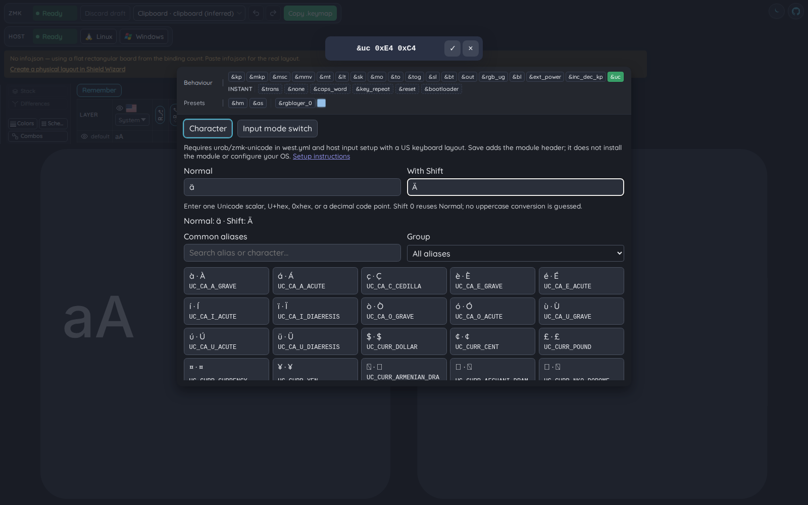

# Unicode picker (urob/zmk-unicode)

The ZMK key editor's `&uc` chip opens a dedicated Unicode picker, separate from
host-layout glyph editing. It edits the firmware binding, not the host keymap.

## Character input

- Enter one Unicode scalar, an explicit `U+...` / `0x...` value, or a decimal
  code point for Normal and With Shift.
- Shift `0` means reuse Normal, as defined by the module. Uppercase conversion
  is never guessed (for example, `ß` pairs with `ẞ`, not the string `SS`).
- Values outside U+0000–U+10FFFF and UTF-16 surrogates are rejected. Multi-code-point
  graphemes and text sequences are not a single `&uc` code point.
- A valid numeric choice writes two cells, for example `&uc 0xE4 0xC4`.
- The searchable, grouped alias grid includes all 292 aliases in the module's
  17 curated headers. Selecting an alias writes its source token, such as
  `&uc UC_DE_AE`. Manual input covers code points outside that grid, including
  supplementary-plane characters.
- Existing recognized aliases and numeric spellings stay unchanged on no-op
  Apply. Unknown external expressions are kept opaque until explicitly replaced.
- Apply commits the staged key edit. Cancel leaves the original binding alone.

## Input-mode switches

The second picker view writes one of the module's six `UC_SET_*` aliases:
macOS, Linux/IBus, Linux alternative, Windows/WinCompose, Windows/HexNumpad,
or Emacs. It switches the keyboard's input system when that key is pressed.
It does not modify the behavior's `default-mode`, install host software, or
change OS settings. HexNumpad is BMP-only and not recommended upstream.

## Firmware and host prerequisites

Follow the complete [module setup instructions](https://github.com/urob/zmk-unicode):

1. Add the `urob` remote and `zmk-unicode` project to `config/west.yml`, matching
   the module revision to the ZMK release (for example `v0.3`).
2. Configure the host's input system: WinCompose on Windows, Unicode Hex Input
   on macOS, IBus/GTK Unicode input on Linux, or the documented alternative.
3. Use a US host keyboard layout; upstream does not support alternative layouts
   for the emitted Unicode input sequence.

When `&uc` is used, the shared save builder ensures
`#include <behaviors/unicode.dtsi>` is present on splice, template, and default
paths. Existing header spelling and other preamble text remain intact. A missing
header is inserted after preprocessor setup and before the first DTS node.
The editor does not edit `west.yml`, `.conf`, or module `default-mode` settings.
Templates and manually supplied extra `UC_*` names remain the firmware owner's
responsibility. In particular, names from the full Unicode name catalog need
`keys-extra.h` or `keys-full.h`; manual numeric bindings avoid that requirement.

## Data provenance

The alias pairs are vendored from
[urob/zmk-unicode at 6ce21267e497e20ff9e05da16d4eefcdd3e89190](https://github.com/urob/zmk-unicode/tree/6ce21267e497e20ff9e05da16d4eefcdd3e89190/include/zmk-unicode/keys).
Their names and pairs were also checked against tag `v0.3`. The upstream MIT
license is retained in `packages/keymap-core/data/zmk-unicode-LICENSE.txt`.
The actual header definitions, not README examples, are authoritative.

Regenerate with `node scripts/update-zmk-unicode-aliases.mjs`. Verify the pinned
upstream bytes without writing with `node scripts/update-zmk-unicode-aliases.mjs --check`.
The application makes no network request for these tables at runtime.

## Executable evidence

- `packages/keymap-core/src/unicode.test.ts`: scalar validation, aliases,
  six mode switches, opaque expressions, and source/header preservation.
- `apps/web/src/lib/components/KeyEditor/UnicodePicker.test.ts`: field input,
  invalid scalar rejection, alias selection, mode switches, opaque expressions.
- `apps/web/src/lib/components/KeyEditor/KeyEditor.test.ts`: Apply gating.
- `apps/web/src/lib/key-edit-session.test.ts`: complete binding assignment and
  no-op macro preservation.
- `e2e/unicode-picker.spec.ts`: browser editing, Copy .keymap, include insertion,
  input-mode binding, and Cancel.

Firmware compilation and physical host input are not tested by the browser
suite; successful editor checks do not prove module installation or OS setup.
